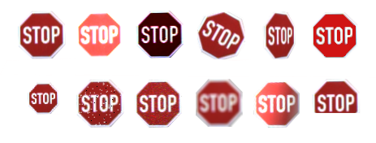

# Dataset generator

This simple repository provides implementation of full-image dataset generator. Result synthetic dataset is supposed to be used for CNN (single-shot detector) training.

## Dependencies

 - OpenCV 3.x and higher

## About the tool

Tool works on simple principle of placing objects to the images of background on the random positions and can work in two different ways.

### 1) Using many cropped objects
Cropped objects (used for classifier training) are placed to the images of background using Poisson blending [1].

<br><b>Cropped traffic sign placed to the background with and without (right) Poisson blending</b>:<br>


### 2) Using few transparent objects

Before transparent objects are placed into background, few effects are applied to synthetically modify appearance of the object.

<br><b>All effects applied on the traffic sign separately (original in the top left corner)</b>:<br>


<br><b>Then objects are placed into background</b>:<br>


## Annotations

This tool is using YOLO [2] annotation format:

```
<object_class> <x> <y> <width> <height>
```

## Usage

 - Place images of the backgrounds (where objects should be placed - in case of traffic signs images should originate from the city-env) to the `data/backgrounds` folder
 - In case of using transparent objects, place them to `data/transparent` folder, otherwise to the `data/cropped`. Place files of each class to separate folder and save unique class name to the imgClass file in same folder
 - In the Makefile, select (comment/uncomment) effects you want to be applied
 - Type `make` in the root folder
 - In case of using transparent objects, type `make runt`, otherwise `make runc`
 - Generated dataset should be in the `out` folder

## Results

Video evaluated using model trained on the traffic sign synthetic dataset generated by this tool:

<a href="http://www.youtube.com/watch?feature=player_embedded&v=J9hYBg76nNQ" target="_blank"></a>
 
## References

[1] [Martino, Matías Di, Gabriele Facciolo and Enric Meinhardt. <em>"Poisson Image Editing."</em> IPOL Journal 6 (2016): 300-325.](https://dl.acm.org/citation.cfm?id=882269)

[2] [Joseph Redmon, Santosh Divvala, Ross Girshick, Ali Farhadi. <em>"You Only Look Once: Unified, Real-Time Object Detection."</em> CoRR Journal (2015)](https://arxiv.org/abs/1506.02640)
